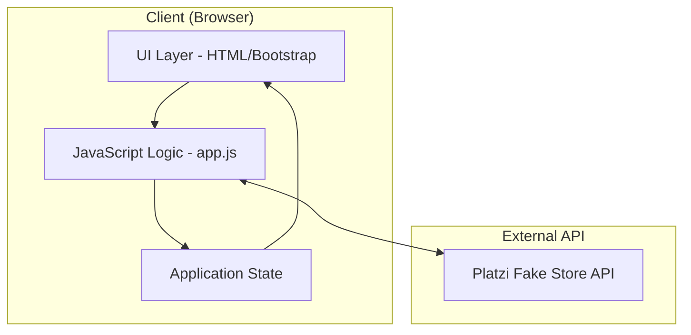
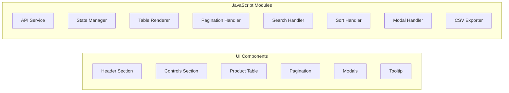

# Design Document: Product Dashboard

## Overview

Product Dashboard là một Single Page Application (SPA) sử dụng HTML5, Bootstrap 5.3, và Vanilla JavaScript để quản lý sản phẩm thông qua Platzi Fake Store API. Ứng dụng được thiết kế theo mô hình client-side rendering với state management đơn giản.

## Architecture

### High-Level Architecture



### Component Architecture




## Components and Interfaces

### 1. Application State

```javascript
// Global State Variables
const API_BASE_URL = 'https://api.escuelajs.co/api/v1';
let allProducts = [];           // All products from API
let filteredProducts = [];      // Products after search filter
let currentPage = 1;            // Current pagination page
let itemsPerPage = 10;          // Items per page (5, 10, 20)
let currentSortField = null;    // 'title' or 'price'
let currentSortOrder = 'asc';   // 'asc' or 'desc'
let currentProductId = null;    // Selected product for edit
```

### 2. API Service Interface

```javascript
// Fetch all products
async function fetchProducts(): Promise<Product[]>

// Fetch single product by ID
async function fetchProductById(id: number): Promise<Product>

// Create new product
async function createProduct(data: ProductInput): Promise<Product>

// Update existing product
async function updateProduct(id: number, data: ProductInput): Promise<Product>
```

### 3. UI Handler Interfaces

```javascript
// Search Handler
function handleSearch(event: InputEvent): void

// Sort Handler  
function handleSort(field: 'title' | 'price'): void

// Pagination Handlers
function goToPage(page: number): void
function changeItemsPerPage(count: number): void

// Modal Handlers
function openDetailModal(productId: number): void
function openEditModal(): void
function openCreateModal(): void
function handleUpdate(): Promise<void>
function handleCreate(): Promise<void>

// Export Handler
function exportToCSV(): void

// Tooltip Handler
function handleTooltip(event: MouseEvent): void
```


## Data Models

### Product Model (from API)

```javascript
interface Product {
    id: number;
    title: string;
    price: number;
    description: string;
    category: {
        id: number;
        name: string;
        image: string;
    };
    images: string[];
}
```

### Product Input Model (for Create/Update)

```javascript
interface ProductInput {
    title: string;
    price: number;
    description: string;
    categoryId: number;
    images: string[];
}
```

### Pagination State

```javascript
interface PaginationState {
    currentPage: number;
    itemsPerPage: number;
    totalItems: number;
    totalPages: number;
    startIndex: number;
    endIndex: number;
}
```

## File Structure

```
product-dashboard/
├── index.html          # Main HTML with Bootstrap structure
├── app.js              # All JavaScript functionality
├── README.md           # Documentation
└── .gitignore          # Git ignore file
```

## HTML Structure Design

### Main Layout

```html
<!DOCTYPE html>
<html lang="vi">
<head>
    <!-- Meta tags, Bootstrap CSS, Font Awesome -->
    <style>/* Custom CSS */</style>
</head>
<body>
    <!-- 1. Header Section -->
    <header class="gradient-header">
        <h1>Product Dashboard</h1>
    </header>
    
    <!-- 2. Controls Section -->
    <div class="container">
        <div class="card">
            <!-- Search input -->
            <!-- Items per page dropdown -->
            <!-- Create button -->
            <!-- Export CSV button -->
        </div>
    </div>
    
    <!-- 3. Product Table -->
    <div class="container">
        <div class="table-responsive">
            <table class="table table-hover">
                <!-- Table headers with sort icons -->
                <!-- Table body with product rows -->
            </table>
        </div>
    </div>
    
    <!-- 4. Pagination -->
    <nav>
        <ul class="pagination">
            <!-- Page buttons -->
        </ul>
        <div class="page-info">
            <!-- Showing X-Y of Z -->
        </div>
    </nav>
    
    <!-- 5. Modals -->
    <!-- Detail Modal -->
    <!-- Edit Modal -->
    <!-- Create Modal -->
    
    <!-- 6. Tooltip Element -->
    <div id="tooltip"></div>
    
    <!-- 7. Loading Spinner -->
    <div id="loading-spinner"></div>
    
    <!-- Scripts -->
    <script src="bootstrap.bundle.min.js"></script>
    <script src="app.js"></script>
</body>
</html>
```


## Correctness Properties

*A property is a characteristic or behavior that should hold true across all valid executions of a system—essentially, a formal statement about what the system should do. Properties serve as the bridge between human-readable specifications and machine-verifiable correctness guarantees.*

### Property 1: Search Filter Correctness

*For any* search term and any product list, the filtered results should only contain products whose titles include the search term (case-insensitive matching).

**Validates: Requirements 2.1, 2.2**

### Property 2: Search Resets Pagination

*For any* search action performed on any page, the currentPage should be reset to 1.

**Validates: Requirements 2.4**

### Property 3: Pagination Boundary Controls

*For any* pagination state, the Previous button should be disabled when currentPage equals 1, and the Next button should be disabled when currentPage equals totalPages.

**Validates: Requirements 3.4, 3.5**

### Property 4: Pagination Info Accuracy

*For any* pagination state with totalItems products and itemsPerPage setting, the displayed "Showing X-Y of Z" should correctly calculate: X = (currentPage - 1) * itemsPerPage + 1, Y = min(currentPage * itemsPerPage, totalItems), Z = totalItems.

**Validates: Requirements 3.6**

### Property 5: Items Per Page Change Resets Pagination

*For any* change in items per page setting, the currentPage should be reset to 1.

**Validates: Requirements 3.7**

### Property 6: Sort Order Correctness

*For any* product list, after sorting by a field (title or price), the products should be in correct order (ascending: each item <= next item, descending: each item >= next item).

**Validates: Requirements 4.1, 4.2**

### Property 7: Sort Toggle Behavior

*For any* current sort state, clicking the same column header should reverse the sort order (asc → desc, desc → asc).

**Validates: Requirements 4.3**

### Property 8: Sort Persistence Across Pages

*For any* sorted product list, navigating to different pages should maintain the same sort order on the underlying filteredProducts array.

**Validates: Requirements 4.5**

### Property 9: Form Validation

*For any* form submission (create or edit) with empty required fields (title, price, description, categoryId), the validation should fail and prevent submission.

**Validates: Requirements 7.6, 8.6**

### Property 10: CSV Export Data Integrity

*For any* current page data, the exported CSV should contain exactly the same number of rows as items on the current page, with all product fields correctly represented.

**Validates: Requirements 9.1**

### Property 11: CSV Special Character Escaping

*For any* product data containing special characters (quotes, commas, newlines), the CSV output should properly escape them according to RFC 4180 standard.

**Validates: Requirements 9.3**


## Error Handling

### API Error Handling

```javascript
async function fetchProducts() {
    try {
        showLoading(true);
        const response = await fetch(`${API_BASE_URL}/products`);
        if (!response.ok) {
            throw new Error(`HTTP error! status: ${response.status}`);
        }
        const data = await response.json();
        return data;
    } catch (error) {
        showError('Failed to load products. Please try again.');
        console.error('Fetch error:', error);
        return [];
    } finally {
        showLoading(false);
    }
}
```

### Form Validation

```javascript
function validateForm(formData) {
    const errors = [];
    if (!formData.title?.trim()) errors.push('Title is required');
    if (!formData.price || formData.price <= 0) errors.push('Valid price is required');
    if (!formData.description?.trim()) errors.push('Description is required');
    if (!formData.categoryId) errors.push('Category is required');
    return errors;
}
```

### Image Error Handling

```javascript
function handleImageError(img) {
    img.onerror = null;
    img.src = 'https://via.placeholder.com/50x50?text=No+Image';
}
```

## Testing Strategy

### Unit Tests

Unit tests should cover:
- Search filter logic with various inputs
- Pagination calculations
- Sort comparison functions
- CSV generation and escaping
- Form validation logic

### Property-Based Tests

Using a property-based testing library (e.g., fast-check for JavaScript), implement tests for:
- Search filter correctness (Property 1)
- Pagination boundary controls (Property 3)
- Sort order correctness (Property 6)
- CSV special character escaping (Property 11)

Each property test should run minimum 100 iterations.

### Integration Tests

- API fetch and display flow
- Create product flow (POST → refresh)
- Update product flow (PUT → refresh)
- Search → pagination → sort combined flow

### Manual Testing Checklist

- Cross-browser testing (Chrome, Firefox, Safari, Edge)
- Mobile responsiveness (320px+)
- Tooltip positioning
- Modal interactions
- CSV download functionality
